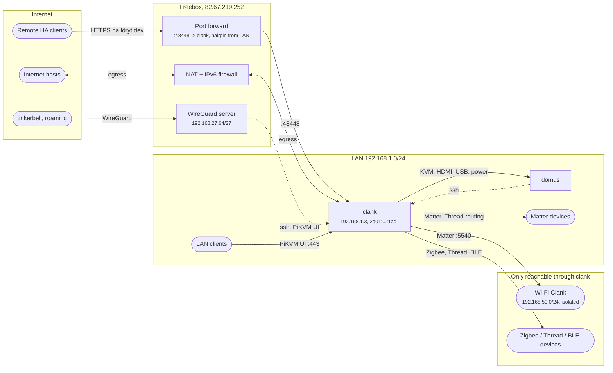
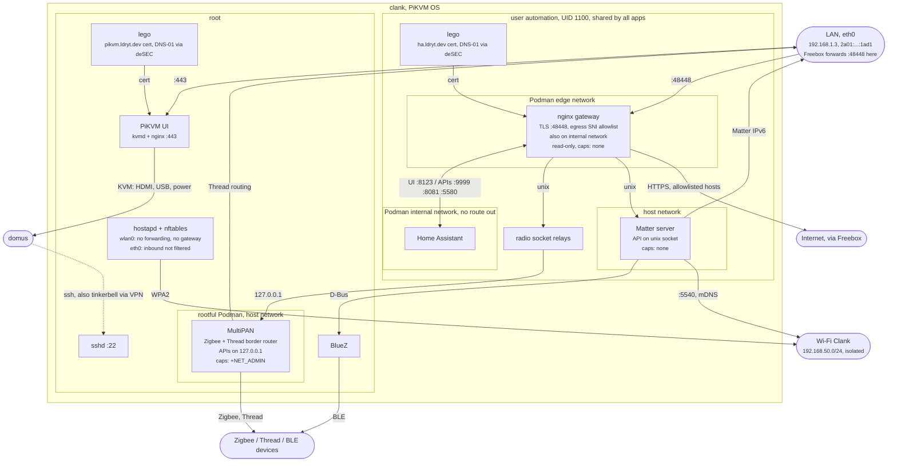

# infra

## Overview

```mermaid
flowchart LR
    subgraph internet["Internet"]
        remote(["Remote HA clients"])
        roaming(["tinkerbell, roaming"])
        web(["Internet hosts"])
    end

    subgraph freebox["Freebox, 82.67.219.252"]
        fwd["Port forward<br/><small>:48448 -> clank, hairpin from LAN</small>"]
        wg["WireGuard server<br/><small>192.168.27.64/27</small>"]
        fw["NAT + IPv6 firewall"]
    end

    subgraph lan["LAN 192.168.1.0/24"]
        lanclients(["LAN clients"])
        domus["domus"]
        clank["clank<br/><small>192.168.1.3, 2a01:...:1ad1</small>"]
        lanmatter(["Matter devices"])
    end

    subgraph attached["Only reachable through clank"]
        wifi(["Wi-Fi Clank<br/><small>192.168.50.0/24, isolated</small>"])
        radiodev(["Zigbee / Thread / BLE devices"])
    end

    remote -->|"HTTPS ha.ldryt.dev"| fwd
    roaming -->|WireGuard| wg
    web <-->|egress| fw
    fwd -->|":48448"| clank
    fw <-->|egress| clank
    wg -.->|"ssh, PiKVM UI"| clank
    domus -.->|ssh| clank
    lanclients -->|"PiKVM UI :443"| clank
    clank -->|"KVM: HDMI, USB, power"| domus
    clank -->|"Matter, Thread routing"| lanmatter
    clank -->|"Matter :5540"| wifi
    clank -->|"Zigbee, Thread, BLE"| radiodev
```

## clank

```mermaid
flowchart TB
    lan(["LAN, eth0<br/><small>192.168.1.3, 2a01:...:1ad1<br/>Freebox forwards :48448 here</small>"])
    domus(["domus"])
    internet(["Internet, via Freebox"])

    subgraph clank["clank, PiKVM OS"]
        subgraph auto["user automation, UID 1100, shared by all apps"]
            lego_ha["lego<br/><small>ha.ldryt.dev cert, DNS-01 via deSEC</small>"]
            subgraph edge["Podman edge network"]
                gateway["nginx gateway<br/><small>TLS :48448, egress SNI allowlist<br/>also on internal network<br/>read-only, caps: none</small>"]
            end
            subgraph internal["Podman internal network, no route out"]
                ha["Home Assistant"]
            end
            relays["radio socket relays"]
            subgraph hostnet["host network"]
                matter["Matter server<br/><small>API on unix socket<br/>caps: none</small>"]
            end
        end
        subgraph root["root"]
            sshd["sshd :22"]
            kvmd["PiKVM UI<br/><small>kvmd + nginx :443</small>"]
            lego_pikvm["lego<br/><small>pikvm.ldryt.dev cert, DNS-01 via deSEC</small>"]
            subgraph rootful["rootful Podman, host network"]
                multipan["MultiPAN<br/><small>Zigbee + Thread border router<br/>APIs on 127.0.0.1<br/>caps: +NET_ADMIN</small>"]
            end
            bluez["BlueZ"]
            ap["hostapd + nftables<br/><small>wlan0: no forwarding, no gateway<br/>eth0: inbound not filtered</small>"]
        end
    end

    wifi(["Wi-Fi Clank<br/><small>192.168.50.0/24, isolated</small>"])
    radiodev(["Zigbee / Thread / BLE devices"])

    lan -->|":48448"| gateway
    lan -->|":443"| kvmd
    domus -.->|"ssh, also tinkerbell via VPN"| sshd
    gateway <-->|"UI :8123 / APIs :9999 :8081 :5580"| ha
    gateway -->|unix| relays
    gateway -->|unix| matter
    relays -->|"127.0.0.1"| multipan
    lego_ha -->|cert| gateway
    lego_pikvm -->|cert| kvmd
    gateway -->|"HTTPS, allowlisted hosts"| internet
    matter -->|D-Bus| bluez
    matter -->|"Matter IPv6"| lan
    multipan -->|"Thread routing"| lan
    matter -->|":5540, mDNS"| wifi
    ap -->|WPA2| wifi
    multipan -->|"Zigbee, Thread"| radiodev
    bluez -->|BLE| radiodev
    kvmd -->|"KVM: HDMI, USB, power"| domus
```
