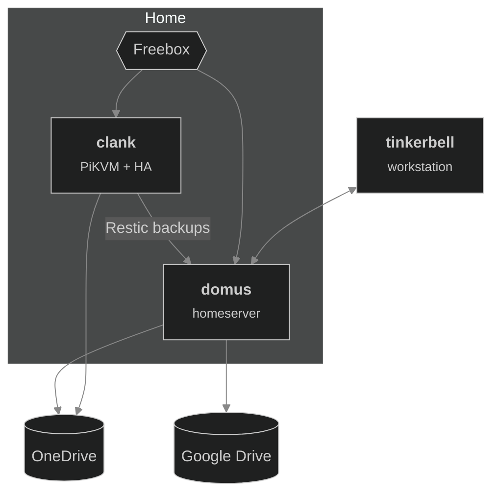
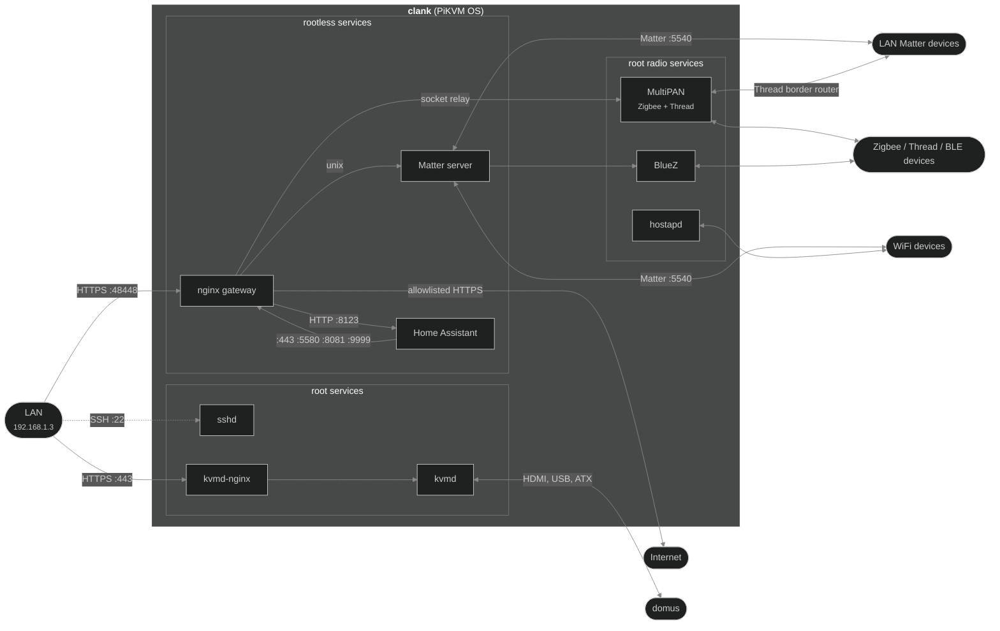

# infra

## Overview

```mermaid
%%{init: {"theme": "dark", "themeVariables": {"lineColor": "#888"}}}%%
flowchart TB
    tinkerbell["<b>tinkerbell</b><br/><small>workstation</small>"]

    subgraph home["Home"]
        freebox{{"Freebox"}}
        domus["<b>domus</b><br/><small>homeserver</small>"]
        clank["<b>clank</b><br/><small>PiKVM + HA</small>"]
    end

    onedrive[("OneDrive")]
    gdrive[("Google Drive")]

    tinkerbell <--> domus
    freebox --> domus
    freebox --> clank
    clank -->|"Restic backups"| domus
    clank --> onedrive
    domus --> onedrive
    domus --> gdrive
```

## clank

```mermaid
%%{init: {"theme": "dark", "themeVariables": {"lineColor": "#888"}}}%%
flowchart LR
    lan(["LAN<br/><small>192.168.1.3</small>"])
    internet(["Internet"])

    subgraph clank["<b>clank</b> (PiKVM OS)"]
        subgraph kvm["root services"]
            sshd["sshd"]
            kvmnginx["kvmd-nginx"]
            kvmd["kvmd"]
        end
        subgraph apps["rootless services"]
            gateway["nginx gateway"]
            ha["Home Assistant"]
            matter["Matter server"]
        end
        subgraph sys["root radio services"]
            multipan["MultiPAN<br/><small>Zigbee + Thread</small>"]
            bluez["BlueZ"]
            ap["hostapd"]
        end
    end

    wifi(["WiFi devices"])
    radio(["Zigbee / Thread / BLE devices"])
    lanmatter(["LAN Matter devices"])
    domus(["domus"])

    lan -->|"HTTPS :48448"| gateway
    lan -->|"HTTPS :443"| kvmnginx
    lan -.->|"SSH :22"| sshd
    kvmnginx --> kvmd
    gateway -->|"HTTP :8123"| ha
    ha -->|":443 :5580 :8081 :9999"| gateway
    gateway -->|unix| matter
    gateway -->|"socket relay"| multipan
    gateway -->|allowlisted HTTPS| internet
    kvmd <-->|"HDMI, USB, ATX"| domus
    matter --> bluez
    matter <-->|"Matter :5540"| wifi
    matter <-->|"Matter :5540"| lanmatter
    ap <--> wifi
    multipan <--> radio
    bluez <--> radio
    multipan <-->|Thread border router| lanmatter
    ha ~~~ internet
```
