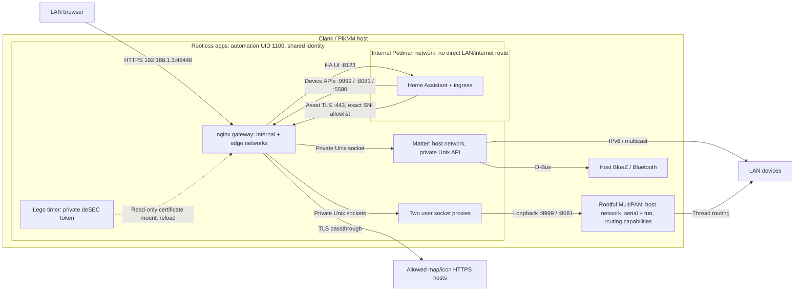

```mermaid
flowchart LR
    browser["LAN browser"]
    assets["Allowed map/icon HTTPS hosts"]
    lan["LAN devices"]
    subgraph clank["Clank / PiKVM host"]
        subgraph apps["Rootless apps: automation UID 1100, shared identity"]
            subgraph internal["Internal Podman network: no direct LAN/internet route"]
                ha["Home Assistant + ingress"]
            end
            gateway["nginx gateway: internal + edge networks"]
            relays["Two user socket proxies"]
            matter["Matter: host network, private Unix API"]
            acme["Lego timer: private deSEC token"]
        end
        radio["Rootful MultiPAN: host network, serial + tun, routing capabilities"]
        bluez["Host BlueZ / Bluetooth"]
    end
    browser -->|"HTTPS 192.168.1.3:48448"| gateway
    gateway -->|"HA UI :8123"| ha
    ha -->|"Device APIs :9999 / :8081 / :5580"| gateway
    ha -->|"Asset TLS :443, exact SNI allowlist"| gateway
    gateway -->|"TLS passthrough"| assets
    gateway -->|"Private Unix sockets"| relays
    relays -->|"Loopback :9999 / :8081"| radio
    gateway -->|"Private Unix socket"| matter
    matter -->|"D-Bus"| bluez
    matter -->|"IPv6 / multicast"| lan
    radio -->|"Thread routing"| lan
    acme -.->|"Read-only certificate mount; reload"| gateway
```
